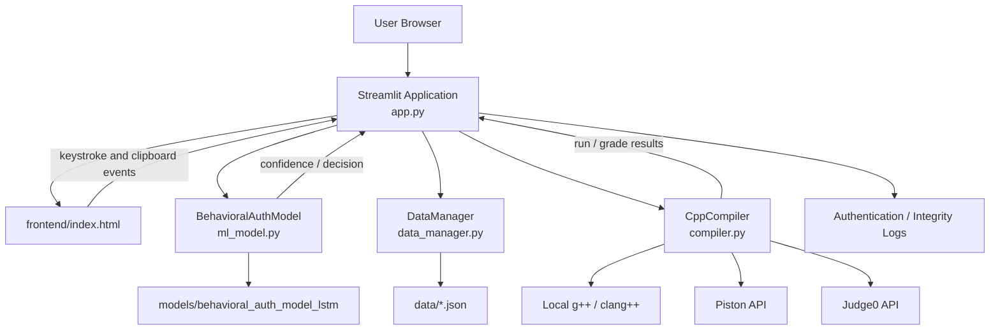

# TrueTestAuth

TrueTestAuth is a Streamlit-based assessment platform that combines **behavioral keystroke authentication**, **continuous identity verification**, **proctored exams**, and an **auto-graded C++ coding-lab environment** for faculty and students.

The application provides separate faculty and student workflows, stores application data in local JSON files, uses a TensorFlow/Keras LSTM model for behavioral authentication, and supports multiple C++ execution backends.

---

## Project Overview

TrueTestAuth is designed around an online-assessment workflow in which faculty create assessments and students complete them under behavioral verification.

The current implementation includes:

- Faculty and student accounts with role-based workflows
- Behavioral keystroke enrollment and authentication
- Continuous behavioral verification during exams and coding labs
- Copy/paste and related browser interaction restrictions in assessment editors
- Timed exams with MCQ auto-grading and descriptive-answer storage
- C++ coding labs with visible and hidden test cases
- Automatic coding-test evaluation and submission history
- Faculty dashboards and behavioral/integrity reports
- PDF question-paper text extraction using `pdfplumber`
- Local JSON persistence
- TensorFlow/Keras LSTM model persistence

---

## Problem Statement

Password authentication verifies credentials at login, but it does not continuously verify the identity of the person completing an online assessment.

TrueTestAuth extends the assessment workflow with keystroke-dynamics-based verification. Typing events are converted into numerical features and evaluated by an LSTM classifier. The platform also logs supported clipboard events and periodically rechecks behavioral confidence during assessments.

For programming labs, the platform additionally provides C++ compilation, execution, hidden-test grading, and submission tracking.

---

## Key Features

### Role-Based Access

The application supports two roles:

- **Faculty** — manage exams, coding labs, enrolled students, submissions, reports, and course settings.
- **Student** — access enrolled courses, complete behavioral verification, attempt exams, solve coding problems, and review submission history.

### Behavioral Authentication

The application extracts a 13-dimensional feature vector from typing events:

1. `mean_dwell`
2. `std_dwell`
3. `median_dwell`
4. `max_dwell`
5. `mean_flight`
6. `std_flight`
7. `median_flight`
8. `min_flight`
9. `typing_speed_wpm`
10. `dwell_flight_ratio`
11. `rhythm_consistency`
12. `total_time_ms`
13. `n_keys`

The resulting vector is normalized and passed to the LSTM model for user-specific probability estimation.

### Continuous Verification

During exams and labs, recent keystroke events can be checked periodically.

The implemented confidence interpretation is:

| Confidence | Status |
| --- | --- |
| `>= 0.65` | Verified |
| `0.45 - < 0.65` | Warning |
| `< 0.45` | Flagged |

The model's main authentication acceptance threshold is `0.45`.

### Copy/Paste Protection

The browser-side assessment interface disables or intercepts:

- Paste
- Copy
- Cut
- Context-menu actions
- Drag-and-drop

Supported paste attempts are also sent to the Streamlit application for logging.

### Proctored Exams

Faculty can create exams containing descriptive questions and MCQs. Exam configuration includes title, course/subject, date, start time, duration, instructions, questions, options, correct answers, and marks.

Student exam sessions include a timer, question navigation, answer persistence, continuous behavioral verification, manual submission, and timer-based automatic submission.

### C++ Coding Labs

Faculty can create coding labs containing multiple C++ problems with:

- Difficulty
- Problem statement
- Time limit
- Memory limit
- Sample tests
- Hidden test cases
- Per-test points
- Starter code

Students receive a browser-based coding interface with run, submit, reset, custom input, output/error display, and behavioral monitoring.

### PDF Question-Paper Extraction

Faculty can upload a PDF question paper. `pdfplumber` is used in `app.py` to extract plain text from the uploaded document.

### Faculty Reporting

The reporting workflow displays behavioral-authentication and academic information, including confidence statistics, flag counts, authentication timelines, exam summaries, and CSV export functionality.

---

## Tech Stack

### Application

- Python
- Streamlit
- Pandas
- NumPy
- Requests
- python-dotenv
- pdfplumber

### Machine Learning

- TensorFlow CPU
- Keras
- LSTM neural network
- Manual z-score normalization

### Frontend

- HTML
- CSS
- JavaScript
- Streamlit custom component protocol

### C++ Execution

- Local `g++` / `clang++`
- Piston API
- Judge0 API

### Persistence

- Local JSON files

---

## System Architecture



---

## Application Architecture

The repository is divided into the following main modules.

### `app.py`

Main Streamlit entry point and application workflow controller. It handles authentication pages, faculty pages, student pages, assessment sessions, frontend events, grading flows, and reports.

### `data_manager.py`

JSON-backed persistence layer for users, enrollments, exams, labs, submissions, authentication logs, and copy/paste logs.

### `ml_model.py`

Contains keystroke feature extraction and the `BehavioralAuthModel` LSTM classifier, including training, prediction, scaling, and model/metadata persistence.

### `compiler.py`

Contains the `CppCompiler` abstraction, local C++ execution, Piston integration, Judge0 integration, result normalization, and hidden-test grading.

### `seed_demo.py`

Creates demo users, synthetic behavioral samples, course enrollments, a demo exam, a demo lab, and the initial LSTM model.

### `ui_components.py`

Provides reusable UI layouts, navigation, cards, metrics, status badges, and assessment layout helpers.

### `frontend/index.html`

Implements the custom browser component for keystroke capture, behavioral-feature generation, exam/coding interfaces, periodic authentication events, and clipboard restrictions.

---

## Project Structure

```text
TrueTestAuth/
├── .devcontainer/
│   └── devcontainer.json
├── .streamlit/
│   └── config.toml
├── frontend/
│   └── index.html
├── models/
│   └── behavioral_auth_model_lstm/
│       ├── lstm_model.keras
│       └── metadata.json
├── data/
│   ├── enrollments.json
│   ├── exams.json
│   ├── labs.json
│   └── users.json
├── .env.example
├── .gitignore
├── app.py
├── compiler.py
├── data_manager.py
├── ml_model.py
├── packages.txt
├── requirements.txt
├── seed_demo.py
├── ui_components.py
└── README.md
```

Runtime activity can additionally create JSON files such as:

```text
data/
├── submissions.json
├── lab_submissions.json
├── auth_logs.json
└── cp_logs.json
```

These files are ignored by `.gitignore` through the `data/*.json` rule.

---

## End-to-End Workflow

```text
Faculty / Student
        |
        v
  Streamlit Application
        |
        +--------------------+
        |                    |
        v                    v
 Authentication        Assessment Workflow
        |                    |
        v                    +-------------------+
   User JSON               |                   |
                           v                   v
                         Exams               C++ Labs
                           |                   |
                           v                   v
                 Continuous Auth       Compile / Execute
                           |                   |
                           v                   v
                    LSTM Prediction     Hidden-Test Grading
                           |                   |
                           +---------+---------+
                                     |
                                     v
                              JSON Persistence
                                     |
                                     v
                               Faculty Reports
```

---

## Behavioral Authentication Workflow

### Enrollment

Student registration collects repeated samples of the phrase:

```text
the quick brown fox jumps
```

The registration interface asks the student to type the phrase exactly 10 times. Each captured sample is converted into the 13-feature representation used by the model.

### Login Verification

The student first enters username/password credentials and then completes behavioral phrase verification.

The model returns the probability assigned to the student's class. The authentication decision is accepted when the probability is at least `0.45`.

### Continuous Authentication

During assessment sessions, the frontend collects recent keystroke events and sends periodic feature vectors back to Streamlit.

The exam workflow schedules continuous checks every 30 seconds, subject to the application's minimum-event requirements.

---

## Model / Algorithm Details

### Feature Extraction

`ml_model.py` computes:

- Mean dwell time
- Standard deviation of dwell time
- Median dwell time
- Maximum dwell time
- Mean flight time
- Standard deviation of flight time
- Median flight time
- Minimum flight time
- Typing speed in WPM
- Dwell/flight ratio
- Rhythm consistency
- Total typing time
- Number of keys

The JavaScript frontend implements the corresponding browser-side feature calculation so that the produced vectors follow the model's expected feature order.

### Normalization

The model uses manual per-feature z-score normalization:

```text
X_scaled = (X - mean) / (std + 1e-8)
```

The learned mean and standard deviation arrays are saved in `metadata.json`.

### LSTM Architecture

The implementation in `ml_model.py` builds the following Keras model:

```text
Input: (13, 1)
    |
    v
LSTM(64, return_sequences=True)
    |
    v
Dropout(0.30)
    |
    v
LSTM(32)
    |
    v
Dropout(0.30)
    |
    v
Dense(32, ReLU)
    |
    v
Dropout(0.15)
    |
    v
Dense(number_of_classes, Softmax)
```

### Training Configuration

| Parameter | Value |
| --- | --- |
| Input features | 13 |
| First LSTM | 64 units |
| Second LSTM | 32 units |
| Dense layer | 32 units, ReLU |
| Dropout | 0.30 |
| Final dropout | 0.15 |
| Epochs | 80 |
| Batch size | 16 |
| Optimizer | Adam |
| Learning rate | `1e-3` |
| Loss | `sparse_categorical_crossentropy` |
| Validation split | `0.15` when at least 10 samples exist |

The model requires at least two distinct user labels before training.

---

## Current Model Artifact

The uploaded project contains:

```text
models/behavioral_auth_model_lstm/
├── lstm_model.keras
└── metadata.json
```

The current model metadata contains these classes:

```text
alice_cs
bob_cs
charlie
```

The repository does not include a separate held-out benchmark dataset or a persisted evaluation report. No independent accuracy, precision, recall, ROC-AUC, or similar benchmark is therefore claimed in this README.

---

## Dataset & Preprocessing

The repository does not contain an external behavioral-keystroke dataset.

Instead, `seed_demo.py` synthesizes training vectors from three predefined typing profiles:

- `alice_cs`
- `bob_cs`
- `charlie`

The seed script generates 15 synthetic samples per student, giving 45 behavioral samples before model training.

The generated samples contain the same 13 features used during inference. `BehavioralAuthModel.fit()` then computes the training mean/std, normalizes the features, reshapes them to `(samples, 13, 1)`, and trains the LSTM classifier.

---

## C++ Coding Workflow

### Run

The **Run** operation executes the current C++ code with the supplied input/sample input and returns compilation/runtime information.

### Submit

The **Submit** operation:

1. Sends the student's C++ code to the Streamlit application.
2. Loads the selected problem's hidden test cases.
3. Executes the code against each hidden test.
4. Normalizes and compares the program output with the expected output.
5. Awards the configured points for passed tests.
6. Stores the submission result.
7. Displays the grading results in the UI.

---

## C++ Execution Backends

`compiler.py` supports three execution engines.

### Local Compiler

The local backend searches for:

```text
g++
```

or:

```text
clang++
```

Compilation uses:

```text
-std=c++17
-O2
-pipe
```

### Piston

The project integrates with:

```text
https://emkc.org/api/v2/piston/execute
```

using C++ version `10.2.0` in the implementation.

### Judge0

The project integrates with Judge0 through RapidAPI:

```text
https://judge0-ce.p.rapidapi.com/submissions
```

The implementation uses C++ language ID `54` and polls the submission result using the returned token.

Judge0 requires the `JUDGE0_API_KEY` environment variable.

---

## Runtime Engine Order

The `CppCompiler` class supports a local-first mode.

The Streamlit application currently initializes the compiler with `prefer_local=True`, so the application attempts execution in this order:

```text
1. Local g++ / clang++
2. Piston
3. Judge0
```

Judge0 is skipped when `JUDGE0_API_KEY` is not configured.

---

## API Documentation

TrueTestAuth does **not** expose a public REST API of its own.

The external APIs used by the compiler module are:

| Service | Method | Endpoint / Purpose |
| --- | --- | --- |
| Piston | `POST` | `/api/v2/piston/execute` — compile and execute C++ |
| Judge0 | `POST` | `/submissions` — create a compilation/execution submission |
| Judge0 | `GET` | `/submissions/{token}` — poll execution result |

The custom frontend also communicates with Streamlit using internal component events such as:

```text
enrollment_sample
verify_phrase
exam_continuous_check
exam_cp_event
exam_answer
lab_run
lab_submit
lab_continuous_check
lab_paste
```

These are application events, not public HTTP API endpoints.

---

## Data Storage

The project uses local JSON files as its persistence layer.

### `data/users.json`

Stores account information including:

- Username
- Password hash
- Full name
- Role
- Course name where applicable
- Enrollment number where applicable
- Creation timestamp
- Behavioral samples
- Enrollment state

### `data/enrollments.json`

Stores student-to-faculty enrollment relationships.

### `data/exams.json`

Stores exam metadata, timing, questions, MCQ options/correct answers, marks, and status.

### `data/labs.json`

Stores coding-lab metadata and problem definitions, including statements, limits, sample tests, hidden tests, starter code, and total points.

### Runtime Files

The application can create:

```text
data/submissions.json
data/lab_submissions.json
data/auth_logs.json
data/cp_logs.json
```

These store exam submissions, lab submissions, authentication records, and copy/paste event records.

---

## Integrity Score

The completed-exam integrity calculation is implemented in `DataManager.calculate_integrity_score()`.

### Behavioral Component

```text
behavioral_score = average_confidence * 100
```

### Clipboard Component

```text
0 paste events  -> 100
1 paste event   -> 80
2 paste events  -> 55
3+ paste events -> 20
```

### Final Score

```text
integrity_score = behavioral_score * 0.6 + paste_penalty * 0.4
```

### Classification

| Integrity Score | Classification |
| --- | --- |
| `>= 70` | High |
| `40 - < 70` | Suspicious |
| `< 40` | Flagged |

These labels are defined by the application's current implementation.

---

## Faculty Reports

The faculty reporting workflow can display:

- Average authentication confidence
- Minimum authentication confidence
- Authentication-check count
- Flag count
- Authentication timeline
- Per-exam summary
- Academic history
- CSV export

---

## Installation & Setup

### Prerequisites

The repository's development container is based on Python 3.11.

For local development, install:

- Python 3.11-compatible environment
- `g++` or `clang++` for local C++ execution

### Clone

```bash
git clone https://github.com/erharsh2104/TrueTestAuth.git
cd TrueTestAuth
```

### Create a Virtual Environment

#### Windows PowerShell

```powershell
python -m venv .venv
.venv\Scripts\Activate.ps1
```

#### Linux / macOS

```bash
python3 -m venv .venv
source .venv/bin/activate
```

### Install Python Dependencies

```bash
pip install -r requirements.txt
```

The repository currently specifies:

- `streamlit>=1.32.0`
- `tensorflow-cpu>=2.16.0,<2.21`
- `numpy>=1.26.0,<2.4`
- `protobuf>=4.25.3,<7`
- `pandas>=2.1.0`
- `requests>=2.31.0`
- `python-dotenv>=1.0.0`
- `pdfplumber>=0.10.0`

---

## Environment Variables

Copy `.env.example` to `.env` when Judge0 integration is required:

```bash
cp .env.example .env
```

Then set:

```text
JUDGE0_API_KEY=your_judge0_api_key
```

No API key or secret is included in this README.

The current `.env.example` also contains a commented legacy `MODEL_PATH` example, but the active application code currently constructs its model path directly rather than reading `MODEL_PATH` from the environment.

---

## Initialize Demo Data

The project provides a demo-seeding script:

```bash
python seed_demo.py
```

It creates or updates the demo environment by:

1. Creating the demo faculty account when needed.
2. Creating the demo student accounts when needed.
3. Generating synthetic behavioral samples.
4. Enrolling the students in the demo course.
5. Training and saving the LSTM behavioral model.
6. Creating the demo exam.
7. Creating the demo coding lab.

---

## Run the Application

Start the Streamlit application with:

```bash
streamlit run app.py
```

The project configures Streamlit to use port `8501`.

Open:

```text
http://localhost:8501
```

---

## Usage

### Faculty Workflow

1. Register or log in as faculty.
2. Open the faculty dashboard.
3. Create or manage exams.
4. Create or manage coding labs.
5. Review exam and lab submissions.
6. Inspect authentication and integrity reports.
7. Review course/student information.

### Student Workflow

1. Register through the faculty/course selection flow.
2. Complete behavioral enrollment by typing the required phrase repeatedly.
3. Log in with the registered credentials.
4. Complete behavioral verification.
5. Open an available exam or coding lab.
6. Complete the assessment while behavioral checks are active.
7. Submit the assessment.
8. Review the resulting submission/integrity information.

---

## Demo Environment

The repository contains demo data for:

### Faculty

```text
prof_sharma
```

### Students

```text
alice_cs
bob_cs
charlie
```

The seeded course is:

```text
CS301 - Data Structures
```

The demo exam is:

```text
Mid-Semester Exam — Data Structures
```

The demo lab is:

```text
Lab 1 — Basic C++ Programming
```

The seeded lab contains:

| Problem | Difficulty |
| --- | --- |
| Hello, World! | Easy |
| Sum of N Numbers | Medium |
| Palindrome Check | Hard |

Demo credentials exist in `seed_demo.py`; they are intentionally not reproduced here.

---

## Streamlit Configuration

`.streamlit/config.toml` currently specifies:

```text
theme.base = "dark"
server.headless = true
server.port = 8501
browser.gatherUsageStats = false
```

---

## Development Container

The repository includes `.devcontainer/devcontainer.json`.

The configuration uses:

```text
mcr.microsoft.com/devcontainers/python:1-3.11-bookworm
```

It installs system packages listed in `packages.txt`, which currently contains:

```text
g++
```

It also installs Python dependencies from `requirements.txt` and forwards port `8501` for the Streamlit application.

---

## Security Considerations

The uploaded implementation is an academic/demo application and should be hardened before production use.

### Password Storage

`data_manager.py` hashes passwords using SHA-256. The implementation does not use a salted password-hashing scheme such as Argon2, bcrypt, or scrypt.

### JSON Persistence

Application state is stored in local JSON files. This is simple for a demo but does not provide the database transaction, concurrency, access-control, and auditing features normally required in production.

### Client-Side Restrictions

Clipboard and browser interaction restrictions are implemented in JavaScript and therefore are not a complete security boundary against a modified or privileged client.

### C++ Code Execution

The local execution path launches submitted C++ programs through subprocesses. Executing untrusted code in production would require stronger isolation and resource controls.

---

## Limitations

The current repository has the following implementation limitations:

- Demo behavioral training data is synthetic.
- No external real-world keystroke dataset is bundled.
- No independent held-out benchmark dataset is included.
- No persisted model evaluation report is included.
- Behavioral authentication is implemented as a multi-class LSTM classifier.
- Passwords use SHA-256 without a salt.
- Application persistence uses local JSON files.
- No public REST API is implemented.
- Browser-side clipboard blocking is not a complete anti-cheating mechanism.
- The local C++ execution backend is not a production sandbox.
- Problem memory limits are stored as configuration but are not enforced as operating-system-level memory restrictions in the local subprocess backend.
- No automated unit/integration test suite is included.
- `.gitignore` ignores the runtime JSON and LSTM model directories/files, so a fresh clone should regenerate demo runtime assets with `seed_demo.py`.

---

## Future Improvements

Potential improvements consistent with the current architecture include:

- Replace JSON persistence with a production database.
- Use Argon2, bcrypt, or scrypt for password hashing.
- Add hardened sandboxing for C++ execution.
- Enforce CPU, memory, filesystem, and network limits during code execution.
- Add a real keystroke-dynamics dataset and independent evaluation split.
- Add model evaluation, calibration, and authentication-performance reporting.
- Add stronger session and authorization controls.
- Add automated unit and integration tests.
- Move active configuration values fully into environment variables.
- Introduce a backend API layer if external clients are required.

---

## Results / Screenshots

The uploaded repository does not contain a dedicated screenshots directory or a persisted benchmark-results report.

The project does contain a trained model artifact:

```text
models/behavioral_auth_model_lstm/lstm_model.keras
```

The training code returns final training and validation accuracy during execution, but those values are not stored as a standalone evaluation report in the repository. Accordingly, this README does not claim a specific benchmark accuracy.

---

## License

No `LICENSE` file or explicit software license is present in the uploaded repository.

Until a license is added, the repository should be treated as **unlicensed**.

---

## Contributors

The repository's Git history identifies:

- **Harsh Tripathi**

Additional history can be viewed through the repository's Git log.

---

## Important Files

| File | Responsibility |
| --- | --- |
| `app.py` | Main Streamlit application and workflow controller |
| `compiler.py` | C++ compilation, execution backends, result handling, and grading |
| `data_manager.py` | JSON persistence and data operations |
| `ml_model.py` | Keystroke feature extraction and LSTM behavioral authentication |
| `seed_demo.py` | Demo data, model training, exam, and coding-lab seeding |
| `ui_components.py` | Reusable interface components and layouts |
| `frontend/index.html` | Browser typing capture and assessment interface |
| `requirements.txt` | Python dependencies |
| `packages.txt` | System package dependency list |
| `.env.example` | Environment-variable template |
| `.streamlit/config.toml` | Streamlit configuration |
| `.devcontainer/devcontainer.json` | Development-container configuration |

---

## Project Status

The current codebase provides an academic/demo assessment platform with:

- Faculty and student roles
- Behavioral enrollment
- Behavioral login verification
- Continuous behavioral monitoring
- Timed exams
- MCQ grading
- Descriptive-answer storage
- C++ coding labs
- Hidden-test auto-grading
- Local JSON persistence
- Faculty reports
- Clipboard-event logging
- TensorFlow/Keras LSTM authentication
- Local and remote C++ execution backends
- A custom Streamlit frontend component

This README is based on the implementation present in the uploaded project and intentionally avoids unsupported features, technologies, metrics, APIs, or claims.
